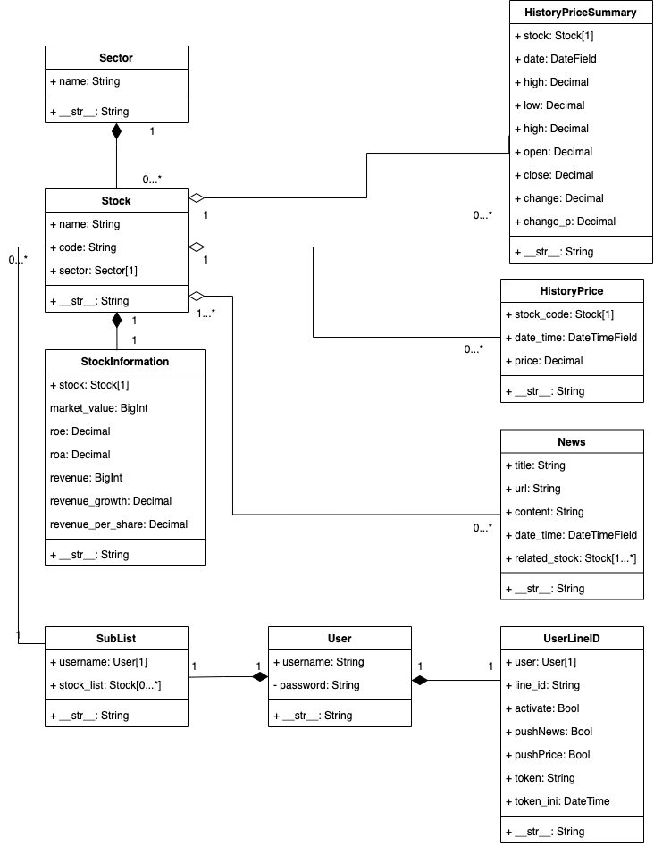

heroku site: 

    [my-stock-view]
    https://my-stock-view.herokuapp.com/

LineBot ID:

    @687oreey

GitHub:

    www.github.com/taco0929

# my-stock-view

-----
##  Apps

- `account`  
  
Views for all account pages.

- `catalog`  
  

  Models and views of `my-stock-view`.
  

 
- `crawler` 
  
Scripts for data crawling.

- `mylinebot`  
  

  Scripts for Linebot to handle reply and push messages.

  

# Setup on Heroku

1. Push to your `heroku` site:  
        
        $ git push heroku <branch>
2. Migrate database:  

        $ heroku run python manage.py migrate
3. Setup your database by CLI:   
   * It is suggested only select few stocks instead of all of them due to limitation of [**Heroku Posgresql**](https://devcenter.heroku.com/changelog-items/96 "10,000 Row Limit Enforced on Heroku Postgres Dev plan").  
   * `get_stock_list` will build up `Stock` items and crawl for information *(as `StockInformation`)* and hisory daily price *(as `HistoryPriceSummary`)*.

            $ heroku run python manage.py shell

            >>> from crawler.scripts.crawler_functions import get_stock_list, get_stock_cur_price
            >>> get_stock_list()
            >>> get_stock_cur_price()

4. Add [**Heroku Scheduler**](https://devcenter.heroku.com/articles/scheduler) to your heroku app, and setup following scheduled tasks:  
        
        # setup stock price crawl task
        $ python manage.py crawl stock      (10 min)

        # setup news crawl task
        $ python manage.py crawl news       (1 hr)

        # setup stock daily price summary crawl task
        $ python manage.py crawl stock_sum  (1 hr)

        # setup database control task
        $ python manage.py DBControl        (1 d)

 

# Connect your Line ID with your my-stock-view account
You can subscribe stocks on `my-stock-view`, and after connecting Line ID with your account, and will push **stock price, news and stock daily price summary** to you.

1. Create a my-stock-view account:  
    https://my-stock-view.herokuapp.com/account/signup/

2. Add Linebot **@687oreey** on your Line
3. Direct to [connect Line](https://my-stock-view.herokuapp.com/account/add_line/) and press `產生驗證碼` to get verification token
4. Send your verfication code to Linebot

 
